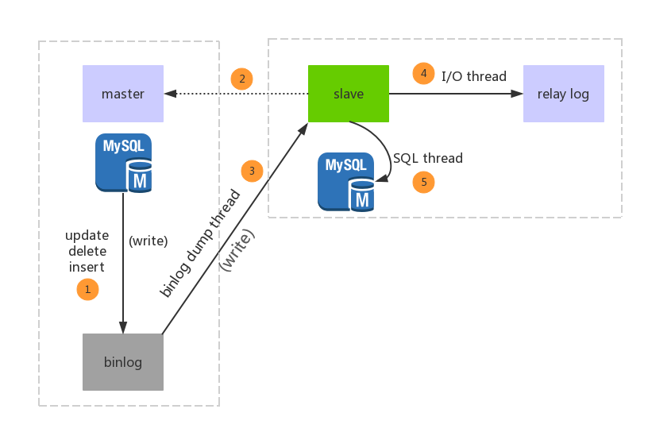

## 前言

所谓读写分离啊，简单来说，就是搞了一个主库，挂多个从库，然后我们单单只是写主库，然后主库会自动把数据同步到从库上。所以前提需要解决mysql是如何进行主从复制的。

## 主从复制

主从复制主要是通过主服务器将更新信息写入到一个特定的二进制文件中，也被称之为binlog文件。这个日志可以记录并发送到从服务器的更细那种去。当一台从服务器连接到主服务器时，从服务器会通知主服务器从服务器的日志文件（binlog）中读取最后一次成功更新的位置。然后从服务器会接受从那个时刻起发生的任何更新，然后锁住并等到主服务器通知新的更新。

### 日志简介

#### binlog

binary log，主库中保存所有更新事件日志的二进制文件。`binlog`是数据库服务启动的一刻起，保存数据库所有变更记录（数据库结构和内容）的文件。在主库中，只要有更新事件出现，就会被依次地写入到`binlog`中，之后会推送到从库中作为从库进行复制的数据源。

### 主从复制涉及三个线程

1. binlog dump thread：主要负责将主库所写的binlog发送到从库
2. slave I/O thread：从库创建的io线程，将主库传过来的binlog内容写入到relay log（中继日志）中
3. SQL thread：从库从relay log里面读取内容，读取最近的更新时间，将更新内容写入从库db

主从

### 主从复制的流程

1. 主库db的更新事件(update、insert、delete)被写到binlog
2. 主库创建一个binlog dump thread，把binlog的内容发送到从库
3. 从库启动并发起连接，连接到主库
4. 从库启动之后，创建一个I/O线程，读取主库传过来的binlog内容并写入到relay log
5. 从库启动之后，创建一个SQL线程，从relay log里面读取内容，从Exec_Master_Log_Pos位置开始执行读取到的更新事件，将更新内容写入到slave的db

### 主从复制原理

其实有点重复了，但是方便理解，再来一遍：

主库将变更写binlog日志，然后从库连接到主库后，从库有一个IO线程，将主库的binlog日志拷贝到自己本地，写入一个中继日志（relay log）中，接着从库中有一个sql线程会从中继日志读取binlog，然后执行binlog日志中的内容，也就是在自己本地再执行一遍sql，这样就可以保证自己跟主库的数据一致。

这里有很重要一点，就是**从库同步主库数据的过程是串行化的，也就是说主库上并行操作，在从库上会串行化执行**，由于从库从主库拷贝日志以及串行化执行sql特点，在高并发情况下，从库数据一定比主库慢一点，是**有延时**的，所以经常出现，刚写入主库的数据可能读不到了，要过几十毫秒，甚至几百毫秒才能读取到。
 还有一个问题，如果突然主库宕机了，然后恰巧数据还没有同步到从库，那么有些数据可能在从库上是没有的，有些数据可能就丢失了。
 所以mysql实际上有两个机制，一个是**半同步复制**，用来解决主库数据丢失问题，一个是**并行复制**，用来解决主从同步延时问题。

- 半同步复制：semi-sync复制，指的就是主库写入binlog日志后，就会将强制此时立即将数据同步到从库，从库将日志写入自己本地的relay log之后，接着会返回一个ack给主库，主库接收到至少一个从库ack之后才会认为写完成。
- 并发复制：指的是从库开启多个线程，并行读取relay log中不同库的日志，然后并行重放不同库的日志，这样库级别的并行。

### 同步延迟问题

通常来说，我们会对于那种写了之后立马就要保证可以查到的场景，采用强制读主库的方式，这样就可以保证读到数据，其实用一些数据库中间件是没问题的。

ps：在春招的时候，被阿里一个面试官问了这样一个问题：在MySQL进行主从复制架构设计之后，由于同步延迟问题，我们可能会遇到数据读取不及时而造成不一致现象，那么如果我们需要强实时性该怎么办。这个问题我没有回答上来，其实答案很简单：强制读主库不就行了~~~

