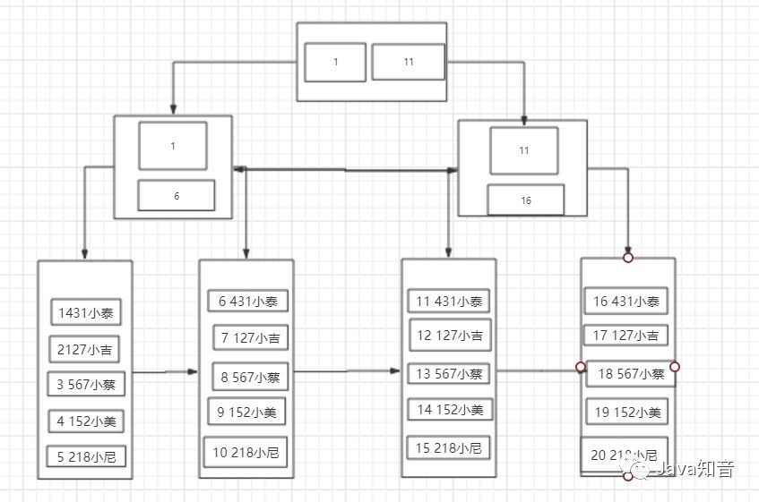

### B+树

　　和常规B+树有些许不同，这是一棵MySQL意义上的B+树，MySQL的一种索引结构，其中的每个节点就可以理解为是一个页，而叶子节点也就是数据页，除了叶子节点以外的节点就是目录页。
　　 　　这一点在图中也可以看出来，非叶子节点只存放了索引，而只有叶子节点中存放了真实的数据，这也是符合B+树的特点的。

#### B+树的优势
- 由于叶子节点上存放了所有的数据，并且有指针相连，每个叶子节点在逻辑上是相连的，所以对于范围查找比较友好。
- B+树的所有数据都在叶子节点上，所以B+树的查询效率稳定，一般都是查询3次。
- B+树有利于数据库的扫描。
- B+树有利于磁盘的IO，因为他的层高基本不会因为数据扩大而增高（三层树结构大概可以存放两千万数据量。

### 聚簇索引和非聚簇索引
　　所谓聚簇索引，就是将索引和数据放到一起，找到索引也就找到了数据，我们刚才看到的B+树索引就是一种聚簇索引，而非聚簇索引就是将数据和索引分开，查找时需要先查找到索引，然后通过索引回表找到相应的数据。InnoDB有且只有一个聚簇索引，而MyISAM中都是非聚簇索引。
#### 我的一点理解：
- InnoDB这个引擎，对于主键索引就是一个聚簇索引，因为它包含了一整行的数据，数据是完整的，我查到该位置就可以直接返回。但是非主键索引的话，叶子节点只存了主键id，说白了就是为了减少数据冗余存储，我根据索引查找数据的话我就可以先查到主键id，然后根据这个id回表查主键索引就可以拿到我想要的数据了。
- 对于MyIsam这个引擎，没有主键，因此全都是非聚簇索引，也就是我查一个索引数据，我只能查到该数据的地址，然后我再根据这个地址去找到对应的数据。
### 联合索引的最左前缀匹配原则
　　我的理解：由于B+树是排序树，联合索引是指索引有多个key组成，这个索引的排序是由先后顺序来排序的，比如(a,b)是按照a排序，b是在a的基础上进行的排序，如果我查询的时候只按照索引b来，或者先查b再查a，那么就会出现b并不是排序好的，它是基于排序a的基础上排序好的，所以就有了最左前缀匹配原则。

### 不走索引的情况
- 第一种当然就是违背最左匹配原则啦，或者根本就没有该索引，怎么走~~
- 第二种我觉得就是由于查询优化器的原因吧，因为MySQL再进行查找数据之前，需要进行查询优化器来衡量是否走该索引，它会选择一个它认为代价最小的方式去查询，
比如说：
　　
　　1. 根据搜索条件，找出所有可能使用的索引
　　
　　2. 计算全表扫描的代价
　　
　　3. 计算使用不同索引执行查询的代价
　　
　　4. 对比各种执行方案的代价，找出成本最低的那一个。