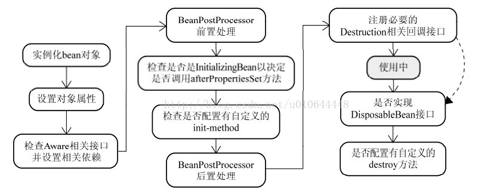

### 什么是循环依赖
　　循环依赖其实就是循环引用，也就是两个或者两个以上的bean互相持有对方，最终形成闭环。比如A依赖于B，B依赖于C，C又依赖于A。如下图：

### Spring循环依赖场景
（1）构造器的循环依赖 

（2）field属性的循环依赖

### 如何解决循环依赖
#### 我的见解
　　首先，由于构造器注入而导致的循环依赖无法解决，意思就是不要在构造器中写依赖对象，不然没法解决。

　　我们知道，在创建一个对象的时候，首先实例化然后初始化，实例化（Java中实例化指new一个对象，但是Spring中是通过反射方式来创建对象的）会执行构造器方法，因此这里是不能有依赖对象的，因为如果依赖对象也没有创建的话，很可能会反复依赖到现在要创建的对象，这样就循环依赖了。因此我们可以先实例化，但是不要急着初始化，待我需要引用的对象实例化之后，我们再进行setter注入岂不是美滋滋。

#### 官方版解决循环依赖~
　　Spring的循环依赖的理论依据基于Java的引用传递，当获得对象的引用时，对象的属性是可以延后设置的。（但是构造器必须是在获取引用之前）

　　Spring的单例对象的初始化主要分为三步：

　　（1）createBeanInstance：实例化，其实也就是调用对象的构造方法实例化对象

　　（2）populateBean：填充属性，这一步主要是多bean的依赖属性进行填充

　　（3）initializeBean：调用spring xml中的init 方法。

　　从上面单例bean的初始化可以知道：循环依赖主要发生在第一、二步，也就是构造器循环依赖和field循环依赖。那么我们要解决循环引用也应该从初始化过程着手，对于单例来说，在Spring容器整个生命周期内，有且只有一个对象，所以很容易想到这个对象应该存在Cache中，Spring为了解决单例的循环依赖问题，使用了三级缓存。

### 三级缓存是啥玩意儿？
#### 三级缓存分别指： 
- 三级：singletonFactories ： 单例对象工厂的cache 
- 二级：earlySingletonObjects ：提前暴光的单例对象的Cache 
- 一级：singletonObjects：单例对象的cache
三级缓存的前提就是要先执行实例化，所以要执行构造器，将其放入三级缓存中，因此构造器导致的循环依赖是无法解决的。
#### 这么理解：
　　我现在要创建一个bean，我首先从一级缓存中找，如果找到，那么久证明这个bean可以用啦，如果没有找到，那么证明还没有该bean。

　　然后我就去二级缓存找，二级缓存找不到就又去三级缓存找，三级缓存找到了，就放到二级缓存中去，并且把三级缓存中的给移除了。

　　二级缓存的对象就表示提前暴露啦，你来找我如果找到了你就可以先引用着。

#### 举个栗子
　　“A的某个field或者setter依赖了B的实例对象，同时B的某个field或者setter依赖了A的实例对象”这种循环依赖的情况。
　　A首先完成了初始化的第一步，并且将自己提前曝光到singletonFactories中，此时进行初始化的第二步，发现自己依赖对象B，此时就尝试去get(B)，发现B还没有被create，所以走create流程，B在初始化第一步的时候发现自己依赖了对象A，于是尝试get(A)，尝试一级缓存singletonObjects(肯定没有，因为A还没初始化完全)，尝试二级缓存earlySingletonObjects（也没有），尝试三级缓存singletonFactories，由于A通过ObjectFactory将自己提前曝光了，所以B能够通过ObjectFactory.getObject拿到A对象(虽然A还没有初始化完全，但是总比没有好呀)，B拿到A对象后顺利完成了初始化阶段1、2、3，完全初始化之后将自己放入到一级缓存singletonObjects中。此时返回A中，A此时能拿到B的对象顺利完成自己的初始化阶段2、3，最终A也完成了初始化，进去了一级缓存singletonObjects中，而且更加幸运的是，由于B拿到了A的对象引用，所以B现在hold住的A对象完成了初始化。

### 基于构造器的循环依赖
　　Spring容器会将每一个正在创建的Bean 标识符放在一个“当前创建Bean池”中，Bean标识符在创建过程中将一直保持在这个池中，因此如果在创建Bean过程中发现自己已经在“当前创建Bean池”里时将抛出BeanCurrentlyInCreationException异常表示循环依赖；而对于创建完毕的Bean将从“当前创建Bean池”中清除掉。

　　Spring容器先创建单例A，A依赖B，然后将A放在“当前创建Bean池”中，此时创建B,B依赖C ,然后将B放在“当前创建Bean池”中,此时创建C，C又依赖A， 但是，此时A已经在池中，所以会报错，，因为在池中的Bean都是未初始化完的，所以会依赖错误 ，（初始化完的Bean会从池中移除）
### 基于Setter循环依赖

先看看这个bean的生命周期：（背下来兄弟）

　　Spring先是用构造实例化Bean对象 ，创建成功后，Spring会通过以下代码提前将对象暴露出来，此时的对象A还没有完成属性注入，属于早期对象，此时Spring会将这个实例化结束的对象放到一个Map中，并且Spring提供了获取这个未设置属性的实例化对象引用的方法。 结合我们的实例来看，当Spring实例化了A、B、C后，紧接着会去设置对象的属性，此时A依赖B，就会去Map中取出存在里面的单例B对象，以此类推，不会出来循环的问题喽

