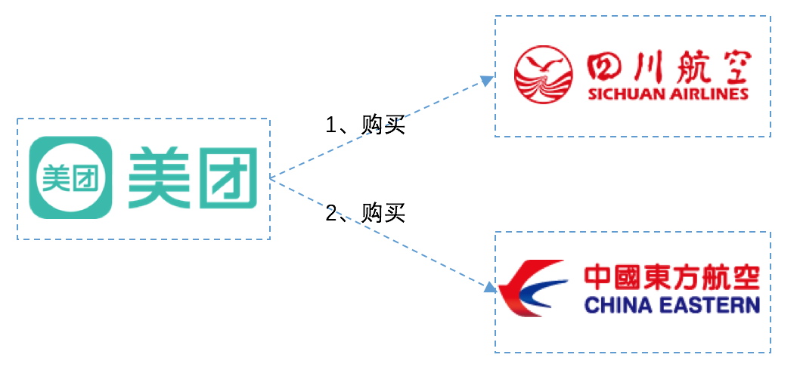

## 分布式事务

## 为什么需要分布式事务呢？

以我做的商城项目为例吧。我的商城项目是基于SOA架构设计的，也就是面向服务的架构，整个项目是由多个服务模块组成的，是一个分布式系统。并且每个服务模块都部署在不同的系统中，不同的服务之间需要进行远程过程调用（RPC）来实现服务的引用。其次，在我的表设计中，并不是只有一个表，而且并不是全都放在一个数据库当中。例如，用户表和订单表就进行了分库，这个也叫做垂直拆分，其次，对于订单表，在订单巨量增加之后，也进行了水平拆分。这里其实就涉及到了分布式事务的问题。当我用户进行下单处理时，需要进行库存删减和创建订单，并且可能还需要进行积分删减等操作，如此一个操作牵扯到许多个服务。如果某一些服务执成功而一些服务执行失败，则会导致数据的不一致，从而造成严重的后果。

## 什么是CAP

1. C：一致性，所有客户端看到都是同一份数据，即使在数据更新和删除之后
2. A：可用性，即使部分节点发生故障，所有客户端也能找到可用的数据备份
3. P：分区容忍性，即使发生网络分区故障，系统仍然能够按照预期正常工作

实际上，P是毋庸置疑一点要保证的，因此必须在CA中进行抉择和衡量，根据生产环境，服务性质而进行取舍，究竟是强一致性而完全牺牲可用性，还是高可用而牺牲一致性，还是最终一致性而保证较高可用性，还是弱一致性通过外部补偿手段而保证高可用？这就可以引出BASE理论了，现在大多分布式事务的设计标准。

## BASE理论

BA：基本可用

S：软状态，相对应状态而言。所谓硬状态就是一个服务出问题能够立即反映到另一台备用机器，数据强一致性。

E：最终一致性

## 常用解决方案

### 强一致性方案

首先，这个不是很可取，因为要基本牺牲可用性，服务性能很容易就达到了瓶颈，并且基本都是串行处理请求，如果一个服务阻塞，会严重其他请求。

##### 2PC

首先说2PC其实不是很常用，因为它会出现阻塞情况，也就是它其实也是保证的强一致性，牺牲了可用性，怎么说呢：

2PC分为两个阶段：

- 阶段一：Prepare（准备阶段、投票阶段）
  - 询问：协调者询问每个参与者能够进行本地事务提交；
  - 投票：参与者根据自身情况向协调者发送Yes/No消息；
- 阶段二：Commit/Cancel（提交阶段，回滚阶段）
  - 决策：如果所有参与者回复Yes则协调者进行全局事务提交，否则全局中止事务；
  - 完成：参与者根据协调者的结果进行事务的提交或回滚。

2PC协议是最基本的原子提交协议，是我们理解其它方案的基础，它最大的缺陷就是阻塞范围太广，协议的任何一方出现故障都会导致协议阻塞而不能进行下去。正是由于它同步大范围阻塞的特性，其性能不是很好，并不是很适用于那些追求性能的高并发场景，但理解它是我们理解后续其它变种协议的基础。

### 最终一致性方案

#### TCC

可能是目前最火的一种柔性事务方案了，对于TCC，不妨通过案例来理解？

案例：我现在要在美团买票，从合肥-->昆明-->大理，没有从合肥直接到大理的，只能中转，我要在美团选择这种中转方案买票。美团如何保证我两张票同时买成功或者失败呢，如果采用TCC方式，他是这样的：

​	从图中我们可以看出来，从合肥到昆明乘坐的是四川航空，从昆明到大理乘坐的是东方航空。

​	由于使用的是美团App预定，当我选择了这种航班预定方案后，美团App要去四川航空和东方航空各帮我购买一张票。如下图：

​	现在问题来了：假设美团先从川航成功买到了票，然后去东航买票的时候，因为天气问题，东航航班被取消了。那么此时，美团必须取消川航的票，因为只有一张票是没用的，不取消就是浪费我的钱。那么如果取消会怎样呢？如果读者有取消机票经历的话，非正常退票，肯定要扣手续费的。在这里，川航本来已经购买成功，现在因为东航的原因要退川航的票，川航应该是要扣代理商的钱的。

​	那么美团就要保证，如果任一航班购买失败，都不能扣钱，怎么做呢？

​	两个航空公司都为美团提供以下3个接口：机票预留接口、确认接口、取消接口。美团App分2个阶段进行调用，如下所示：

**在第1阶段：**

   美团分别请求两个航空公司预留机票，两个航空公司分别告诉美图预留成功还是失败。航空公司需要保证，机票预留成功的话，之后一定能购买到。

**在第2阶段：**

  如果两个航空公司都预留成功，则分别向两个公司发送确认购买请求。

  如果两个航空公司任意一个预留失败，则对于预留成功的航空公司也要取消预留。这种情况下，对于之前预留成功机票的航班取消，也不会扣用户的钱，因为购买并没实际发生，之前只是请求预留机票而已。

   通过这种方案，可以保证两个航空公司购买机票的一致性，要不都成功，要不都失败，即使失败也不会扣用户的钱。如果在两个航班都已经已经确认购买后，再退票，那肯定还是要扣钱的。

  当然，实际情况肯定这里提到的肯定要复杂，通常航空公司在第一阶段，对于预留的机票，会要求在指定的时间必须确认购买(支付成功)，如果没有及时确认购买，会自动取消。假设川航要求10分钟内支付成功，东航要求30分钟内支付成功。以较短的时间算，如果用户在10分钟内支付成功的话，那么美团会向两个航空公司都发送确认购买的请求，如果超过10分钟(以较短的时间为准)，那么就不能进行支付。

读到这里，大致知道了TCC是个什么原理了，那么它是怎么实现的呢，看下面：

TCC是Try-Comfirm-Cancel的简称：

- **Try阶段**：

  完成所有业务检查（一致性），预留业务资源(准隔离性)

  回顾上面航班预定案例的阶段1，机票就是业务资源，所有的资源提供者(航空公司)预留都成功，try阶段才算成功

- **Confirm阶段**：

  确认执行业务操作，不做任何业务检查， 只使用Try阶段预留的业务资源。回顾上面航班预定案例的阶段2，美团APP确认两个航空公司机票都预留成功，因此向两个航空公司分别发送确认购买的请求。

- **Cancel阶段**：

   取消Try阶段预留的业务资源。回顾上面航班预定案例的阶段2，如果某个业务方的业务资源没有预留成功，则取消所有业务资源预留请求。

相比2PC，TCC属于业务层面的分布式事务，不会一直持有资源的锁，资源被修改或者不一致时，便会导致事务回滚，保证的是最终一致性，因此比2PC更可用。

#### 本地事务状态表

​	这种方式依赖于数据库的事务，比如MySQL的ACID种的A（原子性）。具体怎么说呢：

​	假如我现在就是一个事务的提出者，也就是所谓的调用方，我需要执行一个分布式事务时，我不是直接调用其他几个分布式系统，而是在数据库中生成一个记录，表示一个事务开始生成。

​	而后，就开始真正的调用了，没调用成功一个系统，也就是一个成功步骤，就在状态表中进行记录，如果调用失败，那么就可以终止了。这时如果我进行后续处理，那么就可能出现不一致。所以，需要一个定时器进行定时扫描这个状态表，将失败的进行重新调用，或者如果失败多次就回滚，或者失败多次就进行监控上报给相关负责人，让其处理。

#### 消息中间件

基于消息中间件的分布式事务解决方案主要分两类，根据使用的消息中间件是否支持事务消息来划分。我学习的RabbitMQ就支持事务，因此可以根据RabbitMQ的事务特性来做，像Kafka（<0.11.0）不支持事务，那么就得采用另外一种方案。这里介绍不采用事务来解决分布式事务的方案。

**非事务方式**参与事务的系统需要在给消息中间件发送消息之前，把消息的信息和状态存储到本地的消息表中，方案如下图概述：

参与分布式事务的某个系统A接收到请求后，在执行本地事务的同时需要同时将待发送的消息同时记录到事务消息表里面去，**将业务表和消息表放在一个数据库事务里**，保证两者的原子性；执行完后系统A不直接给消息中间件发消息，而是通过后台的定时任务来扫描消息表来进行发送，定时任务会不断的失败重试，直到消息中间件成功返回 ack 消息并更细消息表状态，从而保证消息的不丢失。

消息中间件收到消息后会给后面的事务执行者系统B发送消息，只有系统B成功应答 Ack 消息后消息中间件才会将系统A发送的消息丢弃。由于消息会不断的重复发送，所以事务的所有参与者需要自行保证事务执行的幂等性，比如判重表等手段。

如果是基于RocketMQ或Kafka（>=0.11.0）这类的支持事务操作的消息中间件，上述的方案则可以简化，此时上面的的定时任务的工作将交给消息中间件来提供。

**事务消息**（或者说原子消息）的实现的基本原理是二阶段提交协议（2PC）。它将一个消息的发送操作分为两步，即 Prepare Message（准备消息）和 Confirm Message（确认消息）。如下面的时序图：

其本质就是将前面介绍的定时任务的工作挪到了消息中间件内部完成：消息中间件会对那些处于 Prepare 状态的消息不断进行询问是否可以进行提交投递。

### 弱一致性

比如海量请求的高并发秒杀场景中，就连保证基本可用性也变的非常困难，除了对秒杀的非核心功能降级服务，增加响应时间等，根据CAP定理，我们不得不再次放低对一致性的要求，从最终一致性弱化到弱一致性，从而再次提高系统的性能和可用性。

#### 基于状态的补偿

这是一个根据业务特性进行妥协的一种方案，根据实际的业务场景对立面的数据重要性进行划分，放弃传统的全局数据一致，允许其中个别数据出现不一致但不会对业务产生重大影响。比如在电商网站购物场景中，其中两个主要的步骤是创建订单和扣库存，这分别由两个服务进行处理：订单服务和库存服务。

如果采用前面基于消息的最终一致性方案，创建订单的消息通知库存服务扣除库存，由于异步消息的延迟则会导致超卖；如果采用TCC的方案，每次请求操作都需要Try、Confirm两次请求调用，性能又不能达标；如果采用本地事务状态表，则需要对海量的事务进行状态更新操作，性能和延迟也同样会是个问题。

但是我们可以依据实际的电商购物场景进行取舍：允许少卖，但不能超卖。于是我们可以先扣库存后提交订单，订单创建成功后再关联到库存，这样就不会出现超卖的问题了：

|      | **扣库存** | **提交订单** | **返回结果** | **可能结果** |
| ---- | ---------- | ------------ | ------------ | ------------ |
| 1    | √          | √            | √            |              |
| 2    | √          | ×            | ×            | 多扣库存     |
| 3    | ×          |              | ×            | 多扣库存     |

这里的基于状态的补偿，则是一种事后处理机制，根据库存流水记录查找那些一段时间内未关联订单的库存记录进行撤销操作。比如我们我们在12306上的提交购买车票，那些30分钟内未支付的车票会进行释放。

#### 重试（+回滚）+告警+人工修复

上面的方案对业务场景的要求比较多，对于那些业务流程复杂，需要维护的状态也很复杂，也就是很难根据状态进行自动补偿的时候，我们可以进一步简化操作：不做自动的状态补偿。

还是拿上面那个订单和库存的例子进行说明，比如先扣库存，然后创建订单，如果订单创建失败则重试，重试还是失败则回滚，回滚失败则触发告警，然后人工根据日志记录进行修复。

这个方案其实并没有什么特别的要求，甚至也说不上是什么方案，就是根据业务流程特性一步一步的操作，但里面的关键则是详细的操作日志记录和告警，至于是否需要尝试回滚也是可有可无的。

说白了这个方案就是放弃一致性的要求，也是成本最低最被动的方案。

#### 事后处理-对账

所有的“过程”都会产生“结果”，对账属于事后处理关注的是“结果”，它根据结果（数据）来反推过程（事务）出了问题，从而对数据就行修补。比如每隔一段时间对订单进行扫描，对长时间未处理的订单进行告警。

对账的关键是“找出数据背后的数学规律”，有些好找，有些难。它的一个基本要求是数据记录起码是“完备”的，否则谈何“数学规律”。

严格上来说对账算不上什么方案，更多的是用来辅助人工对数据进行检查，发现其中存在的问题（比如异常、假账）等，然后触执行对应的动作，比如告警。但是我们可以在设计方案的时候根据对账的思路来设计一个自动对账流程来发现不一致的数据并自动修补。